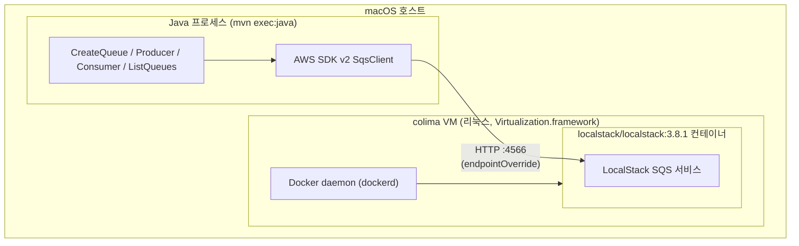
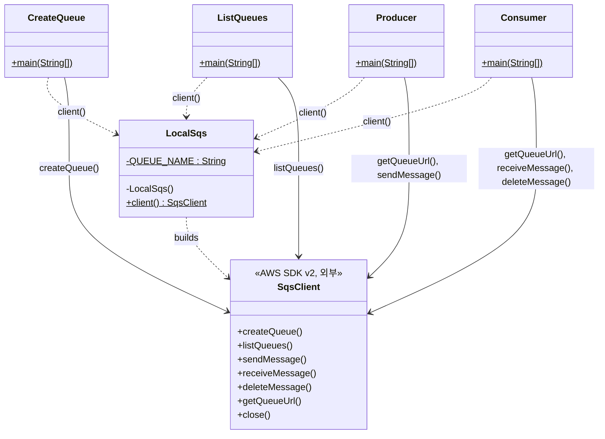
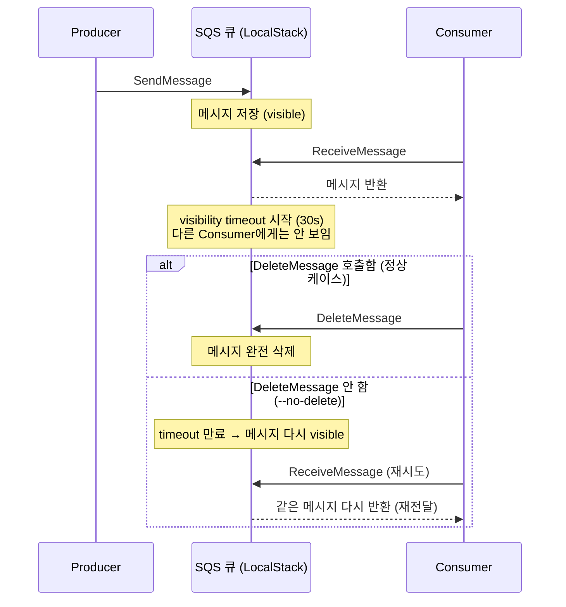

# SQS Playground (LocalStack + Java)

LocalStack으로 로컬에 가짜 SQS를 띄우고, AWS SDK v2(Java)로 메시지를 주고받으며 SQS 동작을 실습하는 프로젝트.

## 스펙 및 구성 요소

| 항목 | 역할 |
|---|---|
| **LocalStack** (`localstack/localstack:3.8.1`, community edition) | 로컬에서 AWS API를 흉내내는 에뮬레이터. 여기선 SQS만 켬. `:latest` 태그는 라이선스 인증을 요구해서 커뮤니티 에디션이 확실한 버전(`3.8.1`)으로 고정 |
| **colima** | macOS에 리눅스 VM을 띄워 그 안에서 도커 데몬을 구동. LocalStack이 리눅스 컨테이너라 도커가 필수인데, Mac은 리눅스 커널이 없어 VM이 항상 필요함 |
| **docker / docker-compose** (CLI만, Docker Desktop 아님) | 컨테이너 실행 및 `docker-compose.yml` 기반 오케스트레이션 |
| **AWS SDK v2 (Java)** | LocalStack의 SQS 엔드포인트에 붙어 큐 생성/발행/수신을 하는 클라이언트 라이브러리 |
| **Maven** | 의존성(AWS SDK) 관리 및 빌드/실행 |
| **JDK 21** | 컴파일 및 실행 런타임 |

### 이 조합을 고른 이유

- **Docker Desktop 대신 colima**: Docker Desktop은 GUI 앱을 한 번 직접 실행해야 데몬이 뜨고, 설치 과정에 sudo 권한(헬퍼 바이너리 심볼릭 링크)이 필요함. colima는 CLI만으로 `colima start` 한 줄로 데몬이 뜨고, brew formula라 sudo 없이 설치됨 — 이 환경에서 sudo 대화형 입력이 불가능해서 colima로 전환함
- **LocalStack 버전 고정**: `latest`가 어느 시점부터 Pro 라이선스 인증을 요구하도록 바뀌어서, community edition이 확실한 버전을 명시적으로 박아둠
- **AWS SDK v2 (v1 아님)**: v1은 유지보수 모드라 신규 프로젝트엔 v2가 표준

## 아키텍처 & 흐름

### 전체 구성 (뭐가 어디서 도는지)



- Java 프로세스와 컨테이너 둘 다 같은 macOS 호스트 위에서 돌지만, 컨테이너는 colima가 띄운 **리눅스 VM 안**에서 실행됨
- SDK는 진짜 AWS SDK 코드지만 `endpointOverride`로 `localhost:4566`(LocalStack)에 붙음 (`LocalSqs.java` 참고, `endpointOverride`만 빼면 실제 AWS로 그대로 연결됨)

### 코드 구조 (`src/main/java/playground/sqs/`)



- `LocalSqs`는 인스턴스화 불가능한 유틸리티 클래스(`private` 생성자 + `static` 메서드만) — 공용 설정을 한곳에 모으는 패턴
- 나머지 4개는 서로 전혀 모르고, 전부 `LocalSqs`에만 의존 → 엔드포인트/자격증명을 한 군데만 고치면 전체가 다 바뀜
- `SqsClient`는 `AutoCloseable`이라 각 `main()`의 `try (SqsClient sqs = ...)` 블록이 끝나면 자동으로 HTTP 커넥션 풀이 정리됨

### 메시지 흐름 (at-least-once / visibility timeout)



이 실습(`## 5`)에서 직접 확인한 것처럼, `DeleteMessage`를 안 부르면 timeout 이후 **같은 메시지가 다시 수신**된다 — 이게 SQS가 기본으로 보장하는 at-least-once delivery의 실체다. 컨슈머 로직은 이 재전달을 전제로 멱등하게 짜야 한다.

### 실행 흐름 (CS 관점)

**`docker compose up -d`가 실제로 하는 일**

1. **colima**가 macOS Virtualization.framework로 띄운 진짜 **리눅스 VM**이 이미 떠있음(`colima start`). macOS 커널은 리눅스 컨테이너에 필요한 cgroup/namespace를 제공 못 하므로 리눅스 커널이 필요함
2. 호스트의 `docker` CLI가 명령을 Unix 도메인 소켓(`~/.colima/default/docker.sock`)에 HTTP(REST API) 형태로 전달 — colima가 VM 안 `dockerd`의 소켓까지 포워딩해줌
3. `dockerd`가 요청을 받아:
   - **이미지 pull**: `localstack/localstack:3.8.1`의 레이어들을 레지스트리에서 받아 **overlay2**(유니온 파일시스템)로 쌓음 — 레이어 단위로 캐싱되어 다음엔 재사용
   - **컨테이너 생성**은 `containerd` → `containerd-shim` → **`runc`**에게 위임. `runc`가 리눅스 커널의 **namespace**(PID/네트워크/마운트/UTS 등 — "이 프로세스는 자기만의 세상을 본다")와 **cgroup**(CPU/메모리 자원 제한)을 만들어 격리된 프로세스로 LocalStack을 실행
4. **포트 매핑** `4566:4566`은 두 단계: VM 내부 iptables NAT가 VM의 4566 → 컨테이너의 4566을 연결하고, colima가 macOS 호스트의 4566 → VM의 4566을 한 번 더 포워딩 — 그래서 `localhost:4566`으로 붙는 게 가능해짐

**`mvn compile exec:java`가 실제로 하는 일**

1. Maven이 `pom.xml`(선언적 프로젝트 모델, POM)을 파싱 → `<dependencies>`의 `software.amazon.awssdk:sqs:2.29.1`을 로컬 캐시(`~/.m2/repository`)에서 찾고 없으면 Maven Central에서 다운로드 → **전이 의존성**(이 라이브러리가 또 의존하는 라이브러리들)까지 재귀적으로 해석해서 하나의 **classpath**를 구성
2. `maven-compiler-plugin`이 그 classpath를 넘겨 `javac`를 호출 → `src/main/java/**/*.java`를 `target/classes/*.class`로 컴파일
3. `exec-maven-plugin`이 그 classpath로 실행 컨텍스트를 만들어 `-Dexec.mainClass`로 지정한 클래스를 **리플렉션**으로 찾아 `main(String[])`을 호출
4. 그 안에서 `SqsClient`가 내부 HTTP 클라이언트로 `localhost:4566`에 TCP 커넥션을 맺고, AWS SQS API 규격(쿼리 파라미터 + SigV4 서명 형식, LocalStack은 서명 검증을 관대하게 넘어감)의 HTTP 요청을 보냄 → LocalStack이 받아 자기 메모리 상태를 갱신하고 응답 반환

즉 이 실습은 **"프로세스 격리(컨테이너) 위에서 도는 가짜 AWS"** ↔ **"JVM 프로세스 위에서 도는 진짜 AWS 클라이언트"**가 TCP 소켓 하나로 대화하는 구조다.

### `target/`은 무엇인가

Maven의 **표준 빌드 출력 디렉토리**. 소스(`src/`)는 그대로 두고, 빌드 과정에서 생성되는 산출물을 전부 여기 모아둔다.

```
target/
├── classes/                          # javac가 컴파일한 .class 파일들
│   └── playground/sqs/*.class
├── generated-sources/annotations/    # 어노테이션 프로세서가 생성하는 소스 (지금은 비어있음)
├── test-classes/                     # 테스트 코드 컴파일 결과 (테스트 없어서 비어있음)
└── maven-status/                     # 증분 컴파일용 메타데이터 (안 바뀐 파일은 재컴파일 스킵)
```

- **완전히 재생성 가능** — `src/`, `pom.xml`만 있으면 `mvn compile`로 언제든 다시 만들 수 있어서 버전 관리 대상이 아님 (`.gitignore`에 `target/` 추가한 이유)
- `mvn clean`을 실행하면 이 디렉토리를 통째로 삭제
- `mvn package`까지 실행하면 여기에 실행 가능한 `.jar`도 생기지만, 지금은 `compile`/`exec:java`까지만 써서 `.jar`는 안 만듦

## 사전 준비

```
brew install docker docker-compose colima
colima start
brew install openjdk@21 maven
export PATH="/opt/homebrew/opt/openjdk@21/bin:$PATH"   # 필요 시 ~/.zshrc에 추가
```

`docker compose` 서브커맨드가 안 잡히면(`docker: unknown command: docker compose`),
`~/.docker/config.json`에 아래 항목을 추가해야 한다:

```json
{
  "cliPluginsExtraDirs": [
    "/opt/homebrew/lib/docker/cli-plugins"
  ]
}
```

## 0. 상태 확인 (이미 떠있는지)

```
colima status                # "colima is running" 이면 기동 중
docker ps                    # sqs-playground-localstack-1 이 보이고 STATUS가 healthy면 정상
curl -s http://localhost:4566/_localstack/health   # "sqs": "available" 확인
```

## 1. LocalStack 기동

```
cd "$(git rev-parse --show-toplevel)/engineering/분산시스템/sqs-playground"   # 어느 위치에서 실행해도 이 디렉토리로 이동
colima start   # 이미 떠있으면 생략 가능
docker compose up -d
```

## 2. 큐 생성

```
cd "$(git rev-parse --show-toplevel)/engineering/분산시스템/sqs-playground"
mvn -q compile exec:java -Dexec.mainClass=playground.sqs.CreateQueue
```

생성된 큐가 (메모리에) 실제로 존재하는지 확인:

```
cd "$(git rev-parse --show-toplevel)/engineering/분산시스템/sqs-playground"
mvn -q compile exec:java -Dexec.mainClass=playground.sqs.ListQueues
```

## 3. 메시지 보내기

```
cd "$(git rev-parse --show-toplevel)/engineering/분산시스템/sqs-playground"
mvn -q compile exec:java -Dexec.mainClass=playground.sqs.Producer
```

## 4. 메시지 받기 (정상 흐름 — 받고 삭제)

```
cd "$(git rev-parse --show-toplevel)/engineering/분산시스템/sqs-playground"
mvn -q compile exec:java -Dexec.mainClass=playground.sqs.Consumer
```

## 5. visibility timeout / 재전달 관찰

```
cd "$(git rev-parse --show-toplevel)/engineering/분산시스템/sqs-playground"
mvn -q compile exec:java -Dexec.mainClass=playground.sqs.Producer
mvn -q compile exec:java -Dexec.mainClass=playground.sqs.Consumer -Dexec.args="--no-delete"
# 30초(visibilityTimeout) 이상 기다린 뒤 다시:
mvn -q compile exec:java -Dexec.mainClass=playground.sqs.Consumer
# -> 같은 메시지가 다시 수신됨 (at-least-once, 재전달)
```

## 종료

```
cd "$(git rev-parse --show-toplevel)/engineering/분산시스템/sqs-playground"
docker compose down
colima stop   # VM 자체를 끄고 싶을 때만 (계속 쓸 거면 생략)
```
