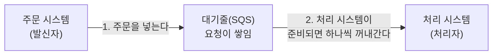
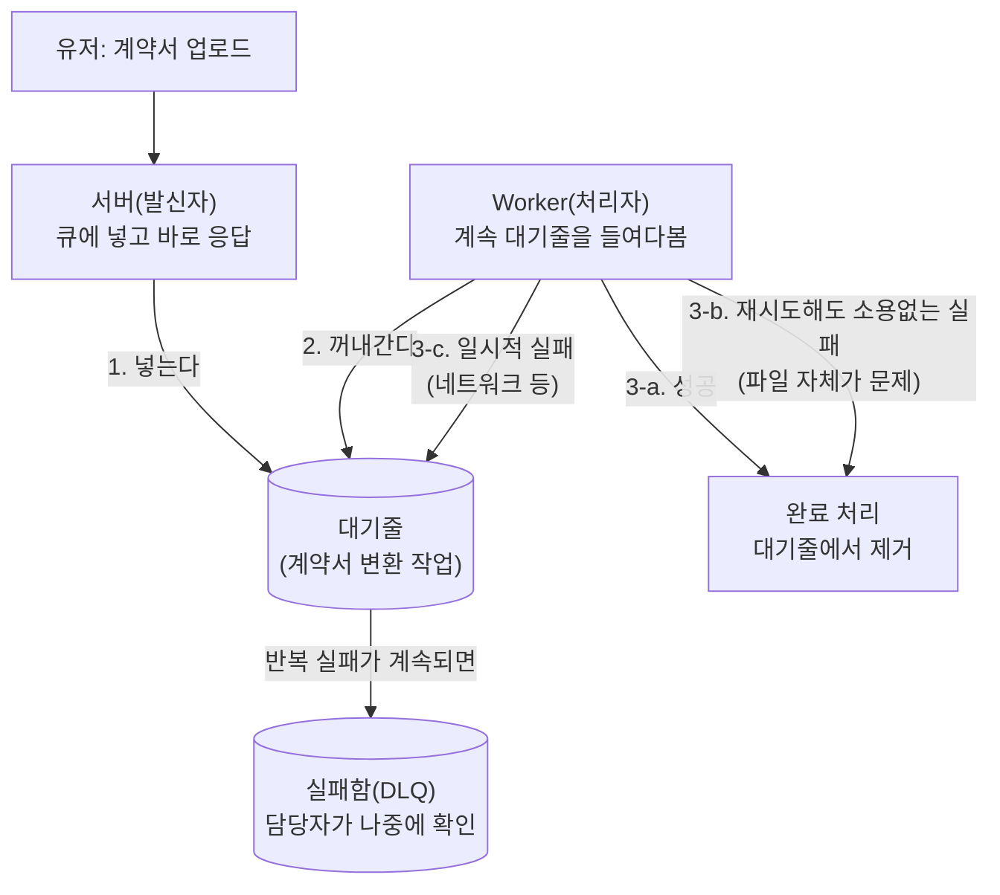

# SQS (메시지 큐)

## 핵심 개념

SQS는 **"메시지 대기줄" 서비스**다. 어떤 시스템이 다른 시스템에게 일을 직접 시키는 대신, 그 사이에 **편지함**을 하나 두고 거기에 요청을 넣어두는 방식이다. 요청을 넣는 쪽(발신자)과 꺼내가는 쪽(처리자)은 서로 존재를 몰라도 되고, 서로의 속도나 상태에 영향을 안 받는다.

## 왜 필요한가

**비유: 온라인 쇼핑몰 주문**

- 고객이 주문을 넣으면(발신자), 주문 처리 시스템(처리자)이 그걸 받아서 재고 확인, 결제, 배송 준비 등을 함
- SQS 없이 두 시스템이 직접 연결돼 있다면: 처리 시스템이 바쁘거나 잠깐 멈추면 → 주문 자체가 실패하거나 씹힘
- SQS를 중간에 두면: 주문은 일단 편지함(큐)에 쌓이고, 처리 시스템은 **자기가 감당할 수 있는 속도로** 하나씩 꺼내서 처리함 → 몰려드는 주문에 시스템이 압사당하지 않고, 처리 시스템이 잠깐 죽어도 주문 자체는 안전하게 보관됨

즉 SQS가 해결하는 문제는 크게 세 가지다:
1. **트래픽 몰림 완충**: 순간적으로 요청이 몰려도 큐가 버퍼 역할을 해서 뒷단이 안 터짐
2. **장애 격리**: 처리 시스템이 잠깐 멈춰도 요청 자체는 유실 안 됨
3. **느슨한 연결**: 두 시스템이 서로 몰라도 됨 — 한쪽을 바꾸거나 늘려도 다른 쪽은 영향 안 받음

## 시스템 아키텍처 흐름 (추상화)



발신자는 큐에 넣고 바로 자기 할 일로 돌아간다. 처리자는 자기 페이스대로 큐를 들여다보며 하나씩 처리한다. 둘은 동시에 살아있을 필요도 없다 — 발신자가 요청을 넣을 때 처리자가 꺼져 있어도, 나중에 다시 켜지면 쌓여있던 요청을 그대로 처리하면 된다.

## 핵심 특징 (동작 원리, 쉬운 말로)

- **"적어도 한 번은 반드시 전달"이 기본 원칙이다.** 처리자가 요청을 꺼내가도, "다 처리했다"고 명시적으로 알려주기 전까지 큐는 그 요청을 완전히 지우지 않는다.
- 만약 처리자가 요청을 꺼내가고 나서 "다 처리했다"는 신호를 안 보내면(처리 중 오류, 시스템 다운 등), 큐는 일정 시간 뒤 **그 요청을 다시 꺼내갈 수 있게 되돌려놓는다.** 그래야 요청이 유실되지 않는다.
- 그 결과 **같은 요청이 두 번 이상 처리될 수도 있다.** 그래서 처리 로직은 "같은 요청을 두 번 실행해도 결과가 달라지지 않도록" 설계해야 한다 (예: "포인트 1000점 적립"을 두 번 실행하면 2000점이 되면 안 되고, 이미 처리한 요청인지 확인하고 건너뛰어야 함).

## 트레이드오프

- **즉시 응답이 필요한 경우엔 안 맞는다.** 큐에 쌓였다가 처리되는 구조라, "요청하자마자 바로 결과를 받아야" 하는 상황(예: 로그인)에는 부적합하다. 어느 정도 지연이 있어도 되는 "일단 접수만 되면 되는" 작업(주문 처리, 알림 발송, 데이터 집계 등)에 적합하다.
- **순서를 반드시 지켜야 하는 경우**엔 기본 큐로는 부족하고 별도의 "순서 보장" 옵션이 필요하다.
- **같은 요청이 중복 처리될 수 있다는 전제**를 처리 시스템이 감당해야 한다 — 이건 SQS의 한계가 아니라, "요청 유실보다 중복이 낫다"는 설계상의 선택이다.

## 실전 프로덕션 사례

위 내용은 개념 설명용 단순화 모델이다. 실제 프로덕션(계약서 PDF를 텍스트로 변환하는 파이프라인)에서는 같은 원리가 이렇게 구체화된다.

### 개념 ↔ 실습 ↔ 프로덕션 매핑

| 추상 개념 | 우리 실습(`sqs-playground`) | 실제 프로덕션 |
|---|---|---|
| 발신자 | `Producer.main()` | Express 서버 — 유저가 계약서를 업로드하면 API가 큐에 발행 |
| 대기줄 | LocalStack이 흉내낸 SQS | 실제 AWS SQS(Standard 큐, `contract-file-text-prod`) |
| 처리자 | `Consumer.main()` | ECS Worker — 서버와 **완전히 분리된 별도 프로세스/컨테이너**로 상시 실행 |
| "다 처리했다" 신호 | `DeleteMessage` | 동일 |
| 재전달 관찰 | `--no-delete` 플래그로 일부러 재현 | 워커가 죽거나 예외가 나면 **저절로** 일어나는 실제 장애 상황 |

### 실제 흐름 (장애 대응까지 포함)



### 발신자와 처리자가 완전히 다른 프로세스로 배포된다

우리 실습에선 `Producer`, `Consumer`가 그냥 각각 다른 `main()`이었지만, 프로덕션에서는 **같은 도커 이미지, 다른 실행 명령**으로 완전히 분리된 배포 단위가 된다.

```
같은 이미지 (한 번 빌드)
  ├─ 서버 서비스   실행 명령: "서버로 실행"  (HTTP 받는 발신자 역할)
  └─ Worker 서비스  실행 명령: "워커로 실행"  (큐만 보는 처리자 역할)
```

왜 나누나: 계약서 텍스트 변환은 CPU를 오래 잡아먹는 무거운 작업이다. 이걸 서버 프로세스 안에서 처리하면 그동안 다른 유저 요청이 전부 밀린다. 아예 프로세스를 분리해서, 서버는 "큐에 넣기만 하고 바로 응답"하고 무거운 작업은 별도 프로세스가 전담한다.

### 큐 하나로 여러 종류의 작업을 처리한다

우리 실습은 큐 하나에 메시지 종류가 한 가지였지만, 실제로는 메시지 안에 "타입"을 넣어서 한 큐로 여러 작업을 처리한다 — "이번 계약서 하나만 변환해줘" / "이 회사 계약서 전체를 소급 재처리해줘" 같은 걸 처리자가 타입을 보고 분기한다.

### 재시도해도 소용없는 실패는 즉시 포기한다

실습에서는 재전달이 무조건 좋은 것처럼 보이지만, 실제로는 **재시도해도 결과가 똑같이 실패할 에러**가 있다 — 예를 들어 업로드된 파일 자체가 깨져있거나, 텍스트가 아예 없는 이미지 스캔본인 경우. 이런 실패는 재시도할 필요가 없으므로 처리자가 즉시 "완료" 신호를 보내 큐에서 지워버린다. 반대로 "네트워크가 잠깐 끊겼다" 같은 일시적 에러는 신호를 안 보내서 재시도되게 둔다.

### 무한 재시도를 막는 안전장치: DLQ (Dead Letter Queue)

일시적 에러라고 믿고 계속 재시도를 허용했는데, 사실은 영영 실패하는 메시지라면? 큐는 "몇 번까지 재시도할지" 상한을 두고, 그 횟수를 넘기면 자동으로 **별도의 실패함(DLQ)**으로 옮겨버린다. 담당자는 이 실패함만 주기적으로 들여다보면서 원인을 조사하면 된다 — 계속 실패하는 요청이 원래 대기줄을 무한정 맴돌며 다른 정상 요청 처리를 방해하는 걸 막는 장치다.

### 왜 "몰라도 되는 구조"가 장애 상황에서 진짜 힘을 발휘하는가

일반 HTTP 요청(예: 파일 형식 변환 API)은 서버가 재배포되며 강제 종료될 때, 처리 중이던 작업이 그냥 끊기고 끝난다 — **누구도 다시 시도해주지 않는다.** 반면 큐를 통해 처리하던 작업은 처리자가 재배포로 죽어도, 대기줄이 "아직 완료 신호를 못 받았다"는 걸 기억하고 있다가 **다른(혹은 재시작된) 처리자에게 자동으로 다시 넘겨준다.** "일이 끝났다"는 걸 확인하는 책임이 각 프로세스가 아니라 **인프라(큐) 쪽에 있다**는 게 핵심 차이이고, 이게 바로 앞서 설명한 "적어도 한 번은 전달"이 실전에서 갖는 의미다.

## 관련 개념

- 비동기 처리 / 이벤트 기반 아키텍처
- 시스템 간 결합도(coupling)
- 멱등성(idempotency) — 같은 요청을 여러 번 처리해도 결과가 같아야 한다는 원칙
- Dead Letter Queue(DLQ) — 반복 실패한 메시지를 격리하는 안전장치
- Pull 기반 소비(처리자가 큐를 능동적으로 조회) vs Push 기반(이벤트가 처리자를 직접 트리거)
